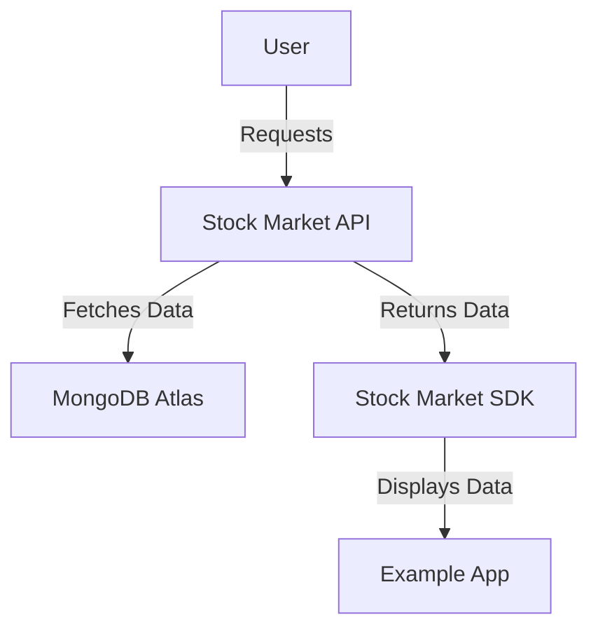

# 🏗️ Architecture & Design

## High-Level Overview

## Components

- **API Service**: Handles data retrieval from financial sources.
- **Android SDK**: Provides a wrapper around the API.
- **Example App**: Demonstrates how to use the SDK.

