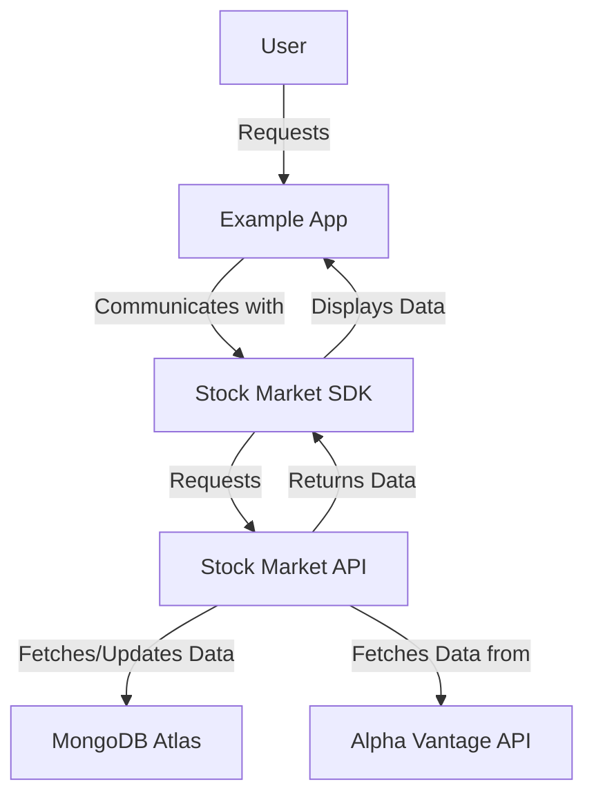

# 📘 Stock Market SDK - Documentation

Welcome to the official documentation for the **Stock Market SDK**.  
This document covers all aspects of the SDK, API, example app, and setup instructions.

---

## Table of Contents
1. [Introduction](#introduction)
2. [API Documentation](#api-documentation)
   - [Stock Market API Endpoints](#stock-market-api-endpoints)
   - [Watchlist API Endpoints](#watchlist-api-endpoints)
3. [Stock Market SDK](#stock-market-sdk)
   - [Installation](#installation)
   - [Usage Examples](#example-usage)
4. [Example Android Application](#example-android-application)
   - [Features](#features)
   - [Setup Instructions (Example App)](#setup)
   - [Screenshots](#screenshots)
5. [Setup & Deployment](#setup--deployment)
6. [Architecture Overview](#architecture-overview)
7. [License](#license)


---

## 🏁Introduction
The Stock Market SDK is designed to help developers easily retrieve stock market data, manage watchlists, and visualize financial trends within their applications.  
Built using **Retrofit**, **Gson**, and **MPAndroidChart**, the SDK offers a seamless integration experience.

---

## 📡API Documentation

### 🌐 Base URL
```
https://pale-caitlin-dev-gal-angel-50977206.koyeb.app/
```

## 🌐 **Base URL**
```
https://pale-caitlin-dev-gal-angel-50977206.koyeb.app/
```

---

## 📌**Stock Market API Endpoints**

### **1️⃣ Get Real-Time Stock Quote**
- **Endpoint:** `GET /stock`
- **Query Parameters:**
   - `symbol` *(required)* – Stock ticker symbol (e.g., `AAPL`, `GOOGL`)
- **Example Request:**
  ```
  GET /stock?symbol=AAPL
  ```
- **Response Example:**
  ```json
  {
      "symbol": "AAPL",
      "open": 180.23,
      "high": 182.10,
      "low": 179.50,
      "price": 181.05,
      "volume": 50234000,
      "latestTradingDay": "2024-02-01",
      "previousClose": 180.50,
      "change": 0.55,
      "changePercent": "0.30%"
  }
  ```

---

### **2️⃣ Get Intraday Stock Data**
- **Endpoint:** `GET /stock/intraday`
- **Query Parameters:**
   - `symbol` *(required)* – Stock ticker symbol
   - `interval` *(optional, default: `5min`)* – Supported: `1min`, `5min`, `15min`, `30min`, `60min`
- **Example Request:**
  ```
  GET /stock/intraday?symbol=GOOGL&interval=5min
  ```
- **Response Example:**
  ```json
  [
      {"timestamp": "2024-02-01 09:30:00", "open": 151.23, "high": 152.00, "low": 150.75, "close": 151.85, "volume": 12000},
      {"timestamp": "2024-02-01 09:35:00", "open": 151.85, "high": 152.50, "low": 151.60, "close": 152.10, "volume": 10000}
  ]
  ```

---

### **3️⃣ Get Historical Time-Series Data**
- **Endpoint:** `GET /stock/time-series`
- **Query Parameters:**
   - `function` *(optional, default: `TIME_SERIES_DAILY`)* – Supported: `DAILY`, `WEEKLY`, `MONTHLY`
   - `symbol` *(required)* – Stock ticker symbol
- **Example Request:**
  ```
  GET /stock/time-series?function=DAILY&symbol=TSLA
  ```
- **Response Example:**
  ```json
  [
      {"timestamp": "2024-02-01", "open": 700.00, "high": 710.50, "low": 695.00, "close": 705.30, "volume": 1000000},
      {"timestamp": "2024-01-31", "open": 690.00, "high": 702.00, "low": 685.00, "close": 698.20, "volume": 950000}
  ]
  ```

---

### **4️⃣ Get Technical Indicators**
- **Endpoint:** `GET /stock/indicators`
- **Query Parameters:**
   - `function` *(required)* – Technical indicator type (e.g., `SMA`, `EMA`)
   - `symbol` *(required)* – Stock ticker symbol
   - `interval` *(required)* – Timeframe (e.g., `daily`, `weekly`)
   - `time_period` *(required)* – Number of periods for calculation
   - `series_type` *(required)* – Price type (`open`, `high`, `low`, `close`)
- **Example Request:**
  ```
  GET /stock/indicators?function=SMA&symbol=AAPL&interval=daily&time_period=20&series_type=close
  ```
- **Response Example:**
  ```json
  [
      {"timestamp": "2024-02-01", "sma": 150.25},
      {"timestamp": "2024-01-31", "sma": 149.80}
  ]
  ```

---

## 📌**Watchlist API Endpoints**

### **5️⃣ Create a New Watchlist**
- **Endpoint:** `POST /watchlists`
- **Query Parameters:**
   - `name` *(required)* – Name of the watchlist
- **Example Request:**
  ```
  POST /watchlists?name=MyFavorites
  ```
- **Response Example:**
  ```json
  {
      "name": "MyFavorites",
      "stocks": []
  }
  ```

---

### **6️⃣ Get All Watchlists**
- **Endpoint:** `GET /watchlists`
- **Example Request:**
  ```
  GET /watchlists
  ```
- **Response Example:**
  ```json
  [
      {"name": "TechStocks", "stocks": ["AAPL", "GOOGL", "MSFT"]},
      {"name": "GrowthStocks", "stocks": ["TSLA", "NVDA"]}
  ]
  ```

---

### **7️⃣ Get All Available Stocks**
- **Endpoint:** `GET /watchlists/stocks`
- **Example Request:**
  ```
  GET /watchlists/stocks
  ```
- **Response Example:**
  ```json
  [
      {"symbol": "AAPL", "price": 181.05},
      {"symbol": "GOOGL", "price": 152.10},
      {"symbol": "TSLA", "price": 705.30}
  ]
  ```

---

### **8️⃣ Get a Specific Watchlist**
- **Endpoint:** `GET /watchlists/{name}`
- **Path Parameter:**
   - `name` *(required)* – Name of the watchlist
- **Example Request:**
  ```
  GET /watchlists/TechStocks
  ```
- **Response Example:**
  ```json
  {
      "name": "TechStocks",
      "stocks": ["AAPL", "GOOGL", "MSFT"]
  }
  ```

---

### **9️⃣ Delete a Watchlist**
- **Endpoint:** `DELETE /watchlists/{name}`
- **Path Parameter:**
   - `name` *(required)* – Name of the watchlist
- **Example Request:**
  ```
  DELETE /watchlists/TechStocks
  ```
- **Response:** `204 No Content`

---

### **🔟 Delete a Stock**
- **Endpoint:** `DELETE /watchlists/stock/{name}`
- **Path Parameter:**
   - `name` *(required)* – Stock symbol
- **Example Request:**
  ```
  DELETE /watchlists/stock/AAPL
  ```
- **Response:** `204 No Content`

---

### **1️⃣1️⃣ Add a Stock to a Watchlist**
- **Endpoint:** `PUT /watchlists/{name}/add-stock`
- **Path Parameter:**
   - `name` *(required)* – Watchlist name
- **Query Parameter:**
   - `stockSymbol` *(required)* – Stock ticker symbol
- **Example Request:**
  ```
  PUT /watchlists/MyFavorites/add-stock?stockSymbol=TSLA
  ```
- **Response Example:**
  ```json
  {
      "name": "MyFavorites",
      "stocks": ["TSLA"]
  }
  ```

---

### **1️⃣2️⃣ Remove a Stock from a Watchlist**
- **Endpoint:** `PUT /watchlists/{name}/remove-stock`
- **Path Parameter:**
   - `name` *(required)* – Watchlist name
- **Query Parameter:**
   - `stockSymbol` *(required)* – Stock ticker symbol
- **Example Request:**
  ```
  PUT /watchlists/MyFavorites/remove-stock?stockSymbol=TSLA
  ```
- **Response Example:**
  ```json
  {
      "name": "MyFavorites",
      "stocks": []
  }
  ```

---

### ✅ **This is the full API documentation covering all available endpoints!**
📌 **You can copy-paste this into your documentation for easy reference.** 🚀

### 📌 Watchlist Management

## 📌 Stock Market API Endpoints Table

| Method   | Endpoint                                          | Description |
|----------|--------------------------------------------------|-------------|
| `GET`    | `/stock`                                         | Get real-time stock quote |
| `GET`    | `/stock/intraday`                                | Get intraday stock data |
| `GET`    | `/stock/time-series`                             | Get historical time-series data (Daily, Weekly, Monthly) |
| `GET`    | `/stock/indicators`                              | Get technical indicators (SMA, EMA, etc.) |
| `POST`   | `/watchlists?name={name}`                        | Create a new watchlist |
| `GET`    | `/watchlists`                                    | Retrieve all watchlists |
| `GET`    | `/watchlists/stocks`                             | Get all available stocks |
| `GET`    | `/watchlists/{name}`                             | Retrieve a specific watchlist |
| `DELETE` | `/watchlists/{name}`                             | Delete a watchlist |
| `DELETE` | `/watchlists/stock/{name}`                       | Delete a stock |
| `PUT`    | `/watchlists/{name}/add-stock?stockSymbol={symbol}` | Add a stock to a watchlist |
| `PUT`    | `/watchlists/{name}/remove-stock?stockSymbol={symbol}` | Remove a stock from a watchlist |


---

## 📦Stock Market SDK

### 📥Installation

1. Add JitPack to `settings.gradle`:
   ```kotlin
   dependencyResolutionManagement {
       repositories {
           maven { url 'https://jitpack.io' }
       }
   }
   ```

2. Add the SDK dependency:
   ```kotlin
   dependencies {
       implementation("com.github.GalAngel15:StockMarketSDK:1.1.0")
   }
   ```

### 🚀Features
- Fetch **real-time** stock quotes: `StockSDK.getStockQuote()`
- Retrieve **historical** data: `StockSDK.getTimeSeries()`
- **Manage watchlists**: Add and remove stocks.

### 🔍Example Usage

#### Fetch a Stock Quote
```java
StockSDK.getStockQuote("AAPL", new Callback_Stock<GlobalQuoteResponse.GlobalQuote>() {
    @Override
    public void onSuccess(GlobalQuoteResponse.GlobalQuote result) {
        System.out.println("Price: " + result.getPrice());
    }
    @Override
    public void onFailure(String errorMessage) {
        System.err.println("Error: " + errorMessage);
    }
});
```

#### Retrieve Historical Data
```java
StockSDK.getTimeSeries(StockSDK.TimeSeries.DAILY, "GOOGL", new Callback_Stock<List<IntradayDataPoint>>() {
    @Override
    public void onSuccess(List<IntradayDataPoint> result) {
        for (IntradayDataPoint point : result) {
            System.out.println("Date: " + point.getTimestamp() + ", Close: " + point.getClose());
        }
    }
    @Override
    public void onFailure(String errorMessage) {
        System.err.println("Error: " + errorMessage);
    }
});
```

---

## 📱Example Android Application

### 🌟Features
- Displays stock data using **MPAndroidChart**.
- Supports **watchlist management** via RecyclerView.
- Uses **Material UI** for a modern look.

### 🔧Setup
1. Clone the repository:
   ```bash
   git clone [https://github.com/GalAngel15/StockMarketSDK-Example.git](https://github.com/GalAngel15/StockMarketSDK.git)
   ```
2. Open in Android Studio and build the project.

---

### Screenshots
<div class="row">


</div>
<div class="row">


   </div>


## Setup & Deployment

### 📡API Deployment
- **Cloud Provider**: Koyeb
- **Database**: MongoDB Atlas
- **Base URL**: `https://pale-caitlin-dev-gal-angel-50977206.koyeb.app/`

### 📤SDK Publishing
- **Repository**: [JitPack](https://jitpack.io/#GalAngel15/StockMarketSDK)

### 📄Documentation Hosting
- **Hosted on GitHub Pages**

---

## Architecture Overview

### 🔹High-Level Overview


### 🏛 Components

- **API Service**: Handles data retrieval from financial sources.
- **Android SDK**: Provides a wrapper around the API.
- **Example App**: Demonstrates how to use the SDK.

---

## 📜License

Distributed under the **MIT License**.  
See `LICENSE` for more information.

---

## 💬 Questions or Feedback?
For any questions, feel free to open an issue on GitHub.

🚀 Happy coding with **Stock Market SDK**!
