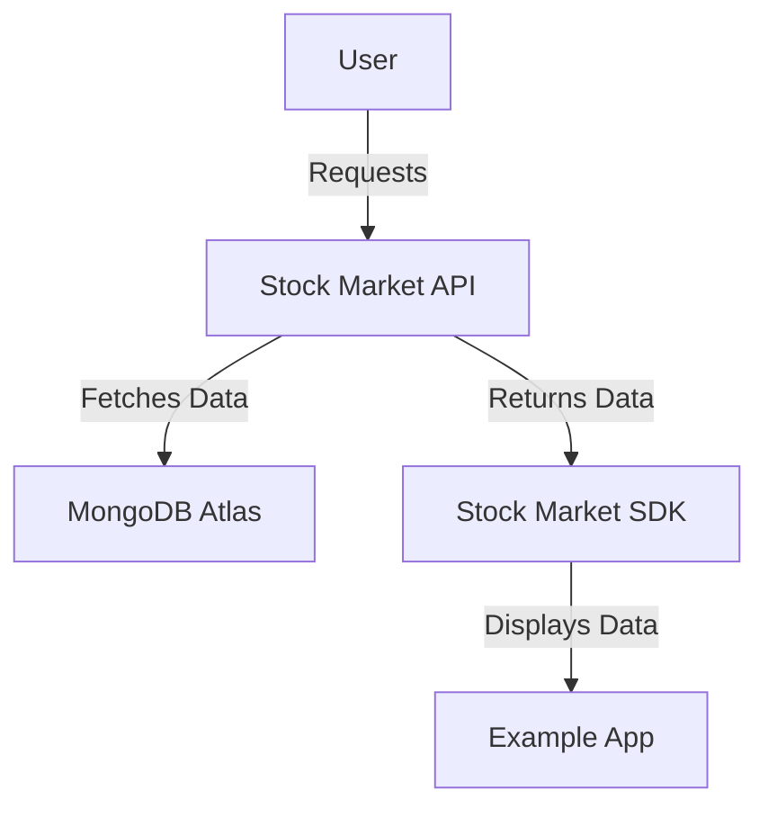

# 📘 Stock Market SDK - Documentation

Welcome to the official documentation for the **Stock Market SDK**.  
This document covers all aspects of the SDK, API, example app, and setup instructions.

---

## 📌 Table of Contents
1. [Introduction](#introduction)
2. [API Documentation](#api-documentation)
3. [Stock Market SDK](#stock-market-sdk)
4. [Example Android Application](#example-android-application)
5. [Setup & Deployment](#setup--deployment)
6. [Architecture Overview](#architecture-overview)

---

## 🏁 Introduction
The Stock Market SDK is designed to help developers easily retrieve stock market data, manage watchlists, and visualize financial trends within their applications.  
Built using **Retrofit**, **Gson**, and **MPAndroidChart**, the SDK offers a seamless integration experience.

---

## 📡 API Documentation

### 🌐 Base URL
```
https://pale-caitlin-dev-gal-angel-50977206.koyeb.app/
```

### 🔹 Endpoints

#### 📌 Get Real-Time Stock Quote
- **Endpoint:** `GET /stock?symbol={symbol}`  
- **Example:** `/stock?symbol=AAPL`

#### 📌 Get Intraday Data
- **Endpoint:** `GET /stock/intraday?symbol={symbol}&interval={interval}`  
- **Example:** `/stock/intraday?symbol=GOOGL&interval=5min`

#### 📌 Get Historical Time-Series Data
- **Endpoint:** `GET /stock/time-series?function={type}&symbol={symbol}`  
- **Example:** `/stock/time-series?function=DAILY&symbol=TSLA`

### 📌 Watchlist Management

| Method  | Endpoint                                                     | Description                      |
|---------|--------------------------------------------------------------|----------------------------------|
| `POST`  | `/watchlists?name={name}`                                    | Create a new watchlist          |
| `GET`   | `/watchlists`                                               | Retrieve all watchlists         |
| `GET`   | `/watchlists/{name}`                                        | Get a specific watchlist        |
| `DELETE`| `/watchlists/{name}`                                        | Delete a watchlist              |
| `PUT`   | `/watchlists/{name}/add-stock?stockSymbol={symbol}`         | Add a stock to watchlist        |
| `PUT`   | `/watchlists/{name}/remove-stock?stockSymbol={symbol}`      | Remove a stock from watchlist   |

---

## 📦 Stock Market SDK

### 📥 Installation

1. Add JitPack to `settings.gradle`:
   ```kotlin
   dependencyResolutionManagement {
       repositories {
           maven { url 'https://jitpack.io' }
       }
   }
   ```

2. Add the SDK dependency:
   ```kotlin
   dependencies {
       implementation("com.github.GalAngel15:StockMarketSDK:1.1.0")
   }
   ```

### 🚀 Features
- Fetch **real-time** stock quotes: `StockSDK.getStockQuote()`
- Retrieve **historical** data: `StockSDK.getTimeSeries()`
- **Manage watchlists**: Add and remove stocks.

### 🔍 Example Usage

#### Fetch a Stock Quote
```java
StockSDK.getStockQuote("AAPL", new Callback_Stock<GlobalQuoteResponse.GlobalQuote>() {
    @Override
    public void onSuccess(GlobalQuoteResponse.GlobalQuote result) {
        System.out.println("Price: " + result.getPrice());
    }
    @Override
    public void onFailure(String errorMessage) {
        System.err.println("Error: " + errorMessage);
    }
});
```

#### Retrieve Historical Data
```java
StockSDK.getTimeSeries(StockSDK.TimeSeries.DAILY, "GOOGL", new Callback_Stock<List<IntradayDataPoint>>() {
    @Override
    public void onSuccess(List<IntradayDataPoint> result) {
        for (IntradayDataPoint point : result) {
            System.out.println("Date: " + point.getTimestamp() + ", Close: " + point.getClose());
        }
    }
    @Override
    public void onFailure(String errorMessage) {
        System.err.println("Error: " + errorMessage);
    }
});
```

---

## 📱 Example Android Application

### 🌟 Features
- Displays stock data using **MPAndroidChart**.
- Supports **watchlist management** via RecyclerView.
- Uses **Material UI** for a modern look.

### 🔧 Setup
1. Clone the repository:
   ```bash
   git clone https://github.com/GalAngel15/StockMarketSDK-Example.git
   ```
2. Open in Android Studio and build the project.

---

## 🛠️ Setup & Deployment

### 📡 API Deployment
- **Cloud Provider**: Koyeb
- **Database**: MongoDB Atlas
- **Base URL**: `https://pale-caitlin-dev-gal-angel-50977206.koyeb.app/`

### 📤 SDK Publishing
- **Repository**: [JitPack](https://jitpack.io/#GalAngel15/StockMarketSDK)

### 📄 Documentation Hosting
- **Hosted on GitHub Pages**

---

## 🏗️ Architecture Overview

### 🔹 High-Level Overview


### 🏛 Components

- **API Service**: Handles data retrieval from financial sources.
- **Android SDK**: Provides a wrapper around the API.
- **Example App**: Demonstrates how to use the SDK.

---

## 📜 License

Distributed under the **MIT License**.  
See `LICENSE` for more information.

---

## 💬 Questions or Feedback?
For any questions, feel free to open an issue on GitHub.

🚀 Happy coding with **Stock Market SDK**!
